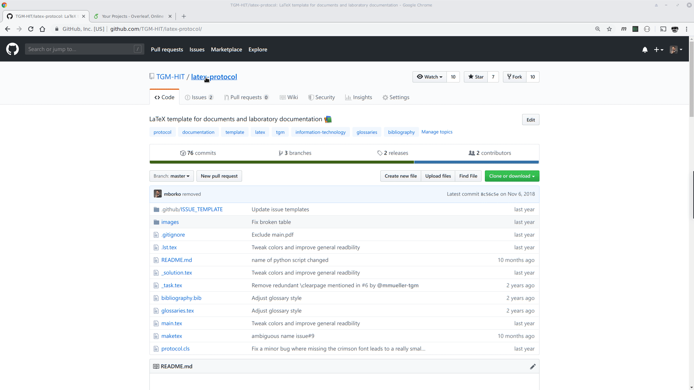

# A latex protocol template

**Quickstart**
```sh
git clone git@github.com:tgm-hit/latex-protocol.git protocol
cd protocol
./maketex
```

**Contents**
- [Dependencies](#dependencies)
- [Usage](#usage)
	- [LaTeX](#latex)
	- [TexStudio](#texstudio)
	- [ShareLatex](#sharelatex)
- [Options](#options)
- [Variables](#variables)

## Dependencies
For local compilation a TeX distribution is required. Both [TeX Live](https://tug.org/texlive/) and [MiKTeX](https://miktex.org/) are fully supported. The [compilation script](https://github.com/TGM-HIT/latex-protocol/blob/master/maketex) requires [Python](https://www.python.org) 3.

Some features might depend on packages which are not installed by default!
A growing list of optional dependencies can be found [here](https://github.com/TGM-HIT/latex-protocol/wiki/Dependencies).

**Arch Linux**
``` sh
sudo pacman -S texlive-most python-pygments
```

## Usage
With Python 3 and LaTeX installed you can easily compile your project using the `maketex` script which simplifies the compilation progress, handles multiple source files and removes unnecessary files.
For most use-cases you only have to run `./maketex` which compiles the `main.tex` file using `pdflatex` while looking for bibliography and glossary entries.

### Latex
If (for some reason) you do not want to depend on the `maketex` script you can also use `pdflatex`, `makeglossaries` and `bibtex` from the shell.
```sh
pdflatex -shell-escape main	# Initial compilation
makeglossaries main 		# Compile glossaries
pdflatex -shell-escape main	# Progressive compilation for glossaries
bibtex main 			# Compile bibliography
pdflatex -shell-escape main	# Progressive compilation for bibtex
pdflatex -shell-escape main	# Progressive compilation for bibtex
```

### TexStudio
In TexStudio a custom command can be added under `Options` &rarr; `Configure TexStudio` &rarr; `Build` &rarr; `User Commands`. The following line completely compiles a LaTeX file with glossaries, bibliography and minted.
```sh
pdflatex -shell-escape -interaction=nonstopmode % | txs:///makeglossaries | pdflatex -shell-escape -interaction=nonstopmode % | txs:///bibtex | pdflatex -shell-escape -interaction=nonstopmode % | pdflatex -shell-escape -interaction=nonstopmode % | txs:///view-pdf-internal --embedded
```

Of course you can also add the `maketex` script as a user command but you might want to set `-lm` so TexStudio can find your log files and minted cache after cleanup.
```sh
python maketex -lm | txs:///view-pdf-internal --embedded
```

### Overleaf
[Overleaf](https://www.overleaf.com/project) is a popular online latex editor and is also fully supported by this template. Just download the archived repository or latest release and upload as a new project.



## Options
Option | Result
------ | ------
`en` | Set main document language to english
`landscape` | Change the page format to landscape orientation
`minted` | Add and configure minted package
`natbib` | Change bibtex backend to natbib
`nobib` | No bibliography
`nofonts` | No additional fonts
`noglo` | No acronyms and glossary
`nologos` | No logos on titlepage
`notable` | No table on titlepage
`notitle` | No titlepage
`notoc` | No table of contents
`parskip` | Skip a line instead of indenting after blank line
`sans` | Load sans-serif fonts

## Variables
Variables can be set as commands like
```tex
\myvariable{value}
```

Command | Content
------- | -------
`mysubtitle` | Subtitle of group
`mysubject` | Thematic group / subject
`mycourse` | Current course / class
`myteacher` | Current teacher
`myversion` | Current version of the document
`mybegin` | Start of documentation
`myfinish` | End of documentation
